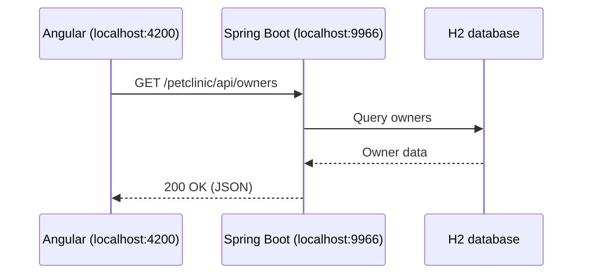

# Petclinic Local Setup

## Petclinic running locally

## Frontend to Backend integration

## Request flow

```mermaid
sequenceDiagram
    participant UI as Angular (localhost:4200)
    participant API as Spring Boot (localhost:9966)
    participant DB as H2 database
    UI->>API: GET /petclinic/api/owners
    API->>DB: Query owners
    DB-->>API: Owner data
    API-->>UI: 200 OK (JSON)
```
